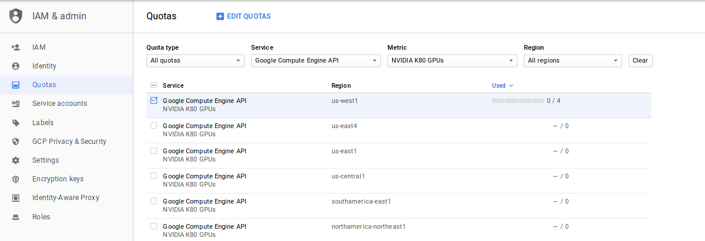

<h1>Create Virtual Machine and its dependencies</h4>
<h4>First of all create an account on Google Cloud Platform (GCP).</h4>
 
Then go to:
  <ul>
     <li>Compute Engine > VM Instances > Create Instance
     <li>follow the steps described on the pictures:
  </ul>

 <ul>
  <li>Choose a name that you like (e.g. test)</li>
  <li>Then select zone (us-east1-b is the cheapest one)</li>
  <li>Number of CPUs, memory and GPUs according to your needs</li>
</ul> 
<ins>Note: If you want to use more powerful GPU you will need to add extra credit (50$) to your account.</ins>

 <ul>
  <li>Select Ubuntu 16.04 with 40GB space</li>
  <li>Allow both firewall checkboxes</li>
  <li>Add your SSH public key if you have one (Optional)</li>
</ul>
<h4>Now let's get and static IP and set a new firewall rule</h4>
  
First go to:
  <ul>
     <li>VPC network > External IP addresses 
     <li>asign one IP to your VM
  </ul>
   Then go to:
    <ul>
     <li>VPC network > Firewall rule details
     <li>copy the values described on the picture:
  </ul>

<h4>Finally, we need to request quotas, so that we can use the GPUs</h4>
   Go to:
    <ul>
     <li>Compute Engine > Quotas > IAM & admin
     <li>In Metric select tyoe the GPU that you want
     <li>Select the service that belongs to your Region
     <li>And go to edit quotas and follow the steps from the GCP
  </ul>

Congrats your VM is ready to be used!!
<h1>Installing NVIDIA CUDA on Google Cloud Platform with Tesla K80 and Ubuntu 16.04</h1>
<h3>Technical Specifications</h3>
 <ul>
  <li>NVIDIA driver 375.66</li>
  <li>CUDA Toolkit 8.0</li>
  <li>cuDNN 5.1 </li>
</ul>
Check you have GPU available.
<pre>lspci | grep -i NVIDIA</pre>

<h3>NVIDIA drivers</h3>
We will install the <a href="http://www.nvidia.com/download/driverResults.aspx/118962/en-us">NVIDIA Tesla Driver</a> via deb package. 
 
<pre>wget http://us.download.nvidia.com/tesla/375.66/nvidia-diag-driver-local-repo-ubuntu1604_375.66-1_amd64.deb
   sudo dpkg -i nvidia-diag-driver-local-repo-ubuntu1604_375.66-1_amd64.deb
   sudo apt-get update
   sudo apt-get install cuda-drivers 
</pre>
<h3>CUDA toolkit</h3>
https://developer.nvidia.com/cuda-downloads
<pre>wget https://developer.download.nvidia.com/compute/cuda/repos/ubuntu1604/x86_64/cuda-repo-ubuntu1604_8.0.61-1_amd64.deb
   sudo dpkg -i cuda-repo-ubuntu1604_8.0.61-1_amd64.deb
   sudo apt-get update
   sudo apt-get install cuda-8.0
</pre>
<h3>cuDNN</h3>

TensorFlow 1.2.1 needs cuDNN 5.1 (not 6.0).

Needs to be downloaded via registered <a href="https://developer.nvidia.com/rdp/cudnn-download">NVIDIA account</a>.
 

This can be downloaded from a browser and then copied to the target machine via SCP:

https://developer.nvidia.com/compute/machine-learning/cudnn/secure/v5.1/prod_20161129/8.0/libcudnn5_5.1.10-1+cuda8.0_amd64-deb
<pre>scp /home/ricard/Downloads/libcudnn5_5.1.10-1+cuda8.0_amd64.deb ricard.durall@35.185.210.7:/home/ricard.durall/</pre>
<ins>Note: 35.185.210.7 this is my static IP, change for yours</ins>
<pre>sudo dpkg -i libcudnn5_5.1.10-1+cuda8.0_amd64.deb</pre>

Reset your VM, and check GPU information:
<pre>nvidia-smi</pre>

<h3>Anaconda</h3>

<pre>wget http://repo.continuum.io/archive/Anaconda3-4.0.0-Linux-x86_64.sh
bash Anaconda3-4.0.0-Linux-x86_64.sh</pre>
<pre>
#Do you wish the installer to prepend the 
#Anaconda3 install location to PATH 
#in your /home/haroldsoh/.bashrc ? 
#[yes|no][no] >>> yes</pre>

<pre>source ~/.bashrc</pre>

<h3>New environment with Tensorflow-gpu</h3>
<pre>conda create -n tf2 pip python=2.7
source activate tf2
pip install tensorflow-gpu==1.2.1 keras==2.0.6</pre>

<h3>Jupyter notebook</h3>
<pre>conda install jupyter</pre>
Try:
<pre>ls ~/.jupytexiter/jupyter_notebook_config.py</pre>

If it doesn’t exist, create one:

<pre>jupyter notebook --generate-config</pre>

Copy following code inside jupyter_notebook_config.py
<pre>c = get_config()
c.NotebookApp.ip = '*'
c.NotebookApp.open_browser = False
c.NotebookApp.port = 8000 </pre>
<ins>Note: 8000 accoridng to the port defined in the new firewall rule</ins>

Finally add the new environment to the Jupter notebook
<pre>python -m ipykernel install --user --name tf2 --display-name "Python (myenv)"</pre>

<h3>Other important links where I got part of the info:</h3>

https://gist.github.com/bzamecnik/b0c342d22a2a21f6af9d10eba3d4597b

https://towardsdatascience.com/running-jupyter-notebook-in-google-cloud-platform-in-15-min-61e16da34d52

http://cs231n.github.io/gce-tutorial/

